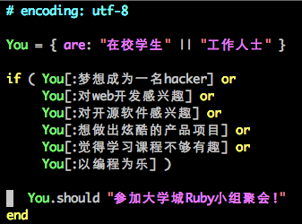

##### 欢迎参加大学城Ruby小组聚会！

了解前沿开发技术Ruby on Rails([https://www.ruby-lang.org/zh_cn/](https://www.ruby-lang.org/zh_cn/), [http://rubyonrails.org/](http://rubyonrails.org/))  
1个小时完成网站开发  
更有经验丰富的开发者现场分享web开发经验  
如果你对web开发感兴趣，喜欢折腾，千万不要错过！

**时间**  2013年12月21日（周六） 下午2点30分至5点

**地点**  [大学城6CIT创业园](http://6cit.com) 

**具体位置**  http://j.map.baidu.com/MrlU6

报名请猛戳 [https://jinshuju.net/f/qvf2Fe](https://jinshuju.net/f/qvf2Fe)  
或扫描二维码报名：  

如有疑问，欢迎联系：

邮箱 allen@dxhackers.com  
QQ 372414077
